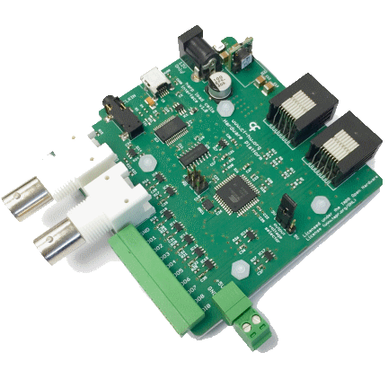

## Harp Load Cells Interface and Reader

This pair of boards can be used to acquire analog signals from load cells and output their data to a USB host. It is additionally able to emit programmable digital events.

### Key Features ###

* Load cells interface
  * Controls up to 2 load cells readers
  * Digital outputs can be regulated at 3V or 5V
* Load Cells Reader
  * Up to 4 load cell sensors
  * 1kHz sampling rate
  * Load cells offset compensation

### Connectivity ###

* Load cells interface
  * 1x BNC input signal (IN0)
  * 1x BNC output signal (Out0)
  * 1x screw terminal connector interface (GND, DOUT1 to DOUT8, DIN0)
  * 2x RJ45 for digital inputs (from load cells devices)
  * 1x stereo jack for clock sync input (CLKIN)
  * 1x USB (for computer)
  * 1x power barrel connector jack (12V only)
  * 1x screw terminal connector for 5V output (GND, +5V)
* Load Cells Reader
  * 4x flick lock connectors (X1 to X4) with 4 analog inputs each (5V, I+, I-, 0V)
  * 1x digital output [RJ45]

## Interface ##

The interface with the Harp board can be done through [Bonsai](https://bonsai-rx.org/) or a dedicated GUI (Graphical User Interface).

In order to use this GUI, there are some software that needs to be installed:

1 - Install the [drivers](https://bitbucket.org/fchampalimaud/downloads/downloads/UsbDriver-2.12.26.zip).

2 - Install the [runtime](https://bitbucket.org/fchampalimaud/downloads/downloads/Runtime-1.0.zip).

3 - Reboot the computer.

4 - Install the [GUI](https://bitbucket.org/fchampalimaud/downloads/downloads/Harp%20Load%20Cells%20v1.1.0.zip).

## Licensing ##

Each subdirectory will contain a license or, possibly, a set of licenses if it involves both hardware and software.
